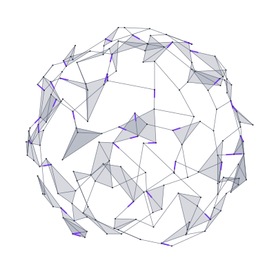

<h1 align="center">Hi there 👋</h1>

    <picture>
        <source media="(prefers-color-scheme: dark)" srcset="./assets/sphere-dark.svg" />
        <source media="(prefers-color-scheme: light)" srcset="./assets/sphere-light.svg" />
        
    </picture>

<h2 align="center">👨🏻‍💻 Whoami</h2>

    <samp>
        I'm Nguyen Pham, people call me Nguyen. 
        AI Engineer at <b>Viettel High Tech</b>. 
        Computer Science graduate from the University of Information Technology, VNU-HCM.
    </samp>

<!-- 

<h2 align="center">🧭 Now</h2>

    <samp>
        🔭 Building [WHAT YOU WORK ON — e.g. a product area or problem type you can share publicly] 
        🌱 Exploring [TOPIC YOU ARE LEARNING] 
        💬 Ask me about [2–3 TOPICS]
    </samp>

 -->
<!-- <h2 align="center">🧰 Toolbox</h2> -->
<!-- 

    <picture>
        <source
            media="(prefers-color-scheme: dark)"
            srcset="https://skillicons.dev/icons?i=python,pytorch,docker,linux,git&theme=dark"
        />
        
    </picture>

 -->
<!-- 
 -->
<!-- <h2 align="center">📫 Reach me</h2>

    <a href="[LINKEDIN URL]">LinkedIn</a> · <a href="mailto:[EMAIL]">Email</a> · <a href="[BLOG / WEBSITE URL]">Blog</a>

 -->

<h3 align="center">Show some ❤️ by starring some of the repositories!</h3>
